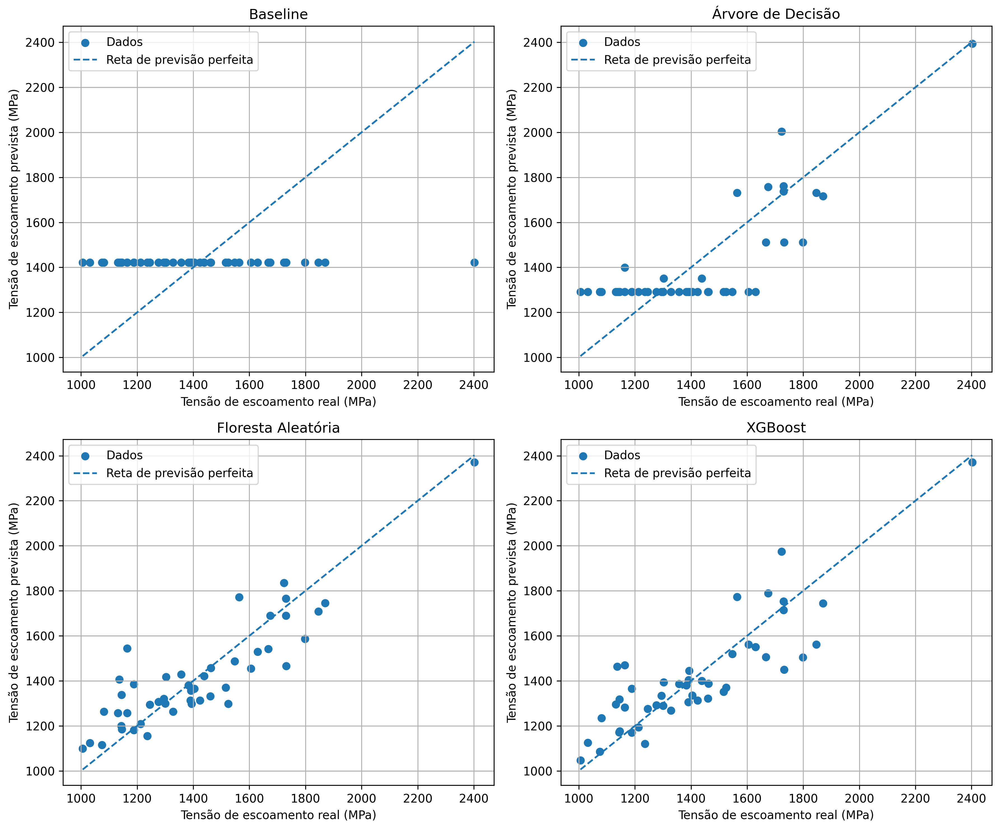

  

<h1 style="text-align: center;">Uma introdução ao XGBoost aplicada à previsão da tensão de escoamento de aços</h1>

  

##  Sobre o projeto

Este projeto foi desenvolvido por Matheus Luiz Mendes de Souza, aluno do segundo semestre do curso de Bacharelado em Ciência e Tecnologia da Ilum – Escola de Ciência, instituição de ensino superior associada ao Centro Nacional de Pesquisa em Energia e Materiais (CNPEM).

Notebook didático desenvolvido na disciplina de Aprendizado de Máquina, com o objetivo de introduzir o algoritmo XGBoost e aplicá-lo a um problema de previsão de propriedades de materiais.

O modelo utiliza dados da composição química de aços para investigar até que ponto modelos de aprendizado de máquina são capazes de aprender padrões que permitam estimar a tensão de escoamento a partir da composição química.

---

##  Objetivo

O principal objetivo deste projeto é compreender os fundamentos do XGBoost, partindo dos conceitos básicos de aprendizado supervisionado e avançando progressivamente por:

- aprendizado supervisionado e problemas de regressão;

- divisão dos dados em treinamento e teste;

- métricas de avaliação;

- árvores de decisão;

- overfitting e controle da complexidade;

- modelo Baseline;

- Random Forest;

- Gradient Boosting;

- XGBoost;

- otimização de hiperparâmetros.

Além da parte teórica, os conceitos são aplicados a um problema de ciência dos materiais.

---

##  Problema científico

A tensão de escoamento é uma propriedade mecânica importante para a caracterização e seleção de materiais. Diferentes composições químicas podem estar associadas a diferentes comportamentos mecânicos.

Nesse contexto, surge a possibilidade de utilizar dados experimentais já disponíveis para construir modelos capazes de estimar propriedades de materiais sem a necessidade de realizar um novo experimento para cada composição.

O projeto investiga essa possibilidade utilizando machine learning para regressão da tensão de escoamento de aços.

---

##  Dataset

Foi utilizado o dataset matbench_steels, disponibilizado no ecossistema Matminer.

O conjunto contém informações sobre:

- composição química dos aços (feature);

- tensão de escoamento (target).

A composição química é transformada em variáveis numéricas associadas aos elementos presentes nas amostras, permitindo que os modelos de aprendizado de máquina recebam uma matriz de features X e um vetor de target y.

---
## Principais resultados

Na avaliação inicial, os modelos de ensemble apresentaram desempenho superior ao baseline e à árvore de decisão.

Os resultados obtidos foram aproximadamente:

| Modelo             |        RMSE |     R² |
| ------------------ | ----------: | -----: |
| Baseline           |     183 MPa | ≈ 0,00 |
| Árvore de Decisão  |     165 MPa |  0,632 |
| Floresta Aleatória |     130 MPa |  0,775 |
| XGBoost            |     138 MPa |  0,746 |
| XGBoost otimizado  | **131 MPa** |  0,767 |

Os valores apresentados são referentes ao conjunto de teste e servem principalmente para a comparação entre os modelos estudados no notebook.

A Floresta Aleatória apresentou o melhor desempenho entre os modelos avaliados inicialmente, enquanto a otimização posterior melhorou o desempenho do XGBoost.
  
---

## Tecnologias utilizadas

- Python;

- Jupyter Notebook;

- NumPy;

- Pandas;

- Matplotlib;

- Seaborn;

- Scikit-learn;

- XGBoost;

- Matminer;

- Pymatgen.

---

##  Como executar
 
Clone o repositório:

>git clone <URL_DO_REPOSITORIO>

Entre no diretório:

>cd <NOME_DO_REPOSITORIO>

Instale as dependências necessárias:

>pip install numpy pandas matplotlib seaborn scikit-learn xgboost matminer pymatgen jupyter

Abra o notebook:

>jupyter notebook

Em seguida, execute o arquivo:

>esfinge_MLMS.ipynb

Recomenda-se executar as células na ordem, do início ao fim.

---

## Docentes responsáveis

> Este trabalho só foi possível graças ao apoio do professor da matéria de Aprendizado de Máquina.

<table>
  
  <td align="center">
          <a href="#" title="Prof. Daniel R. Cassar">
         
          <a href="https://github.com/drcassar"><b>Prof. Dr. Daniel R. Cassar<b></a>
      </a>

  </tr>
</table>

---

## Autor
> O material foi produzido por Matheus Luiz Mendes de Souza, aluno do segundo semestre do curso de Bacharelado em Ciência e Tecnologia da Ilum - Escola de Ciência. 
<table>
  <tr>

   <td align="center">
      <a href="#" title="Matheus Souza">
         
          <a href="https://github.com/matheuslmds"><b>Matheus Souza<b></a>
      </a>
    </td>
  </tr>
</table>

--- 

##  Referências principais

- Chen, T.; Guestrin, C. (2016). XGBoost: A Scalable Tree Boosting System.

- XGBOOST DEVELOPERS. XGBoost documentation. Disponível em: <https://xgboost.readthedocs.io/en/stable/>. Acesso em: 12 set. 2026.

- INRIA. Machine learning in Python with scikit-learn. Scikit-learn MOOC. Disponível em: <https://inria.github.io/scikit-learn-mooc/>. Acesso em: 9 set. 2026

- Faceli et al. (2021). Inteligência Artificial: Uma Abordagem de Aprendizado de Máquina.

- Ward, L., Dunn, A., Faghaninia, A., Zimmermann, N. E. R., Bajaj, S., Wang, Q., Montoya, J. H., Chen, J., Bystrom, K., Dylla, M., Chard, K., Asta, M., Persson, K., Snyder, G. J., Foster, I., Jain, A., Matminer: An open source toolkit for materials data mining. Comput. Mater. Sci. 152, 60-69 (2018).

- CITRINATION. Mechanical properties of some steels. Dataset ID 153092, versão 3. Contribuição de Gareth Conduit (University of Cambridge) e Intellegens. 2017. Disponível em: <https://citrination.com/datasets/153092/show_files/>. Acesso em: 12 set. 2026.